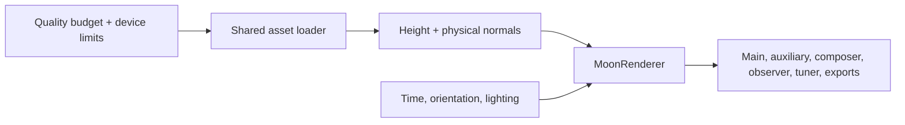

# Moon rendering architecture

**One Physical renderer, three quality budgets.** All 3D Moon views use the same lighting equations, terrain units and normal-generation algorithm. Current has been removed. Implemented on `codex/moon-loading-audit`; deployment is pending.

## Code organization

Paths are relative to `src/platform/js/`.

| Owner | Responsibility |
| --- | --- |
| `rendering/moon-renderer.js` | Moon geometry, material, the shared Physical shader and GPU resource replacement. |
| `app/moon-render-asset-profiles.js` | Low/Medium/High assets and rendering budgets. |
| `app/texture-loader.js` | Preview delivery, background loading, cancellation and shared decode requests. |
| `workers/moon-dem-worker.js` | Decode precise height data and load prepared normals; generate normals when needed. |
| `rendering/moon-physical-normal-data.js`, `moon-terrain-package.js` | The common normal algorithm, terrain reduction and binary format used by preparation tools and runtime. |
| `app/moon-render-pipeline.js`, `moon-lighting-models.js` | Physical tuning, diagnostics and migration of old settings. |
| `core/domain/render-device-policy.js` | Device defaults, GPU texture limits and display-resolution caps. |

`app/moon-actions.js` creates the mission Moon. Auxiliary views and Frame & Shoot render the same mesh through their cameras. Observer and tuner pages instantiate the same renderer/loader; exports use the existing scene. Camera pose, shot exposure and fill lighting can vary by view. SVG orbit diagrams, feature markers and the Earth-only ground-track globe are separate representations.

## Physical pipeline

Every completed tier has terrain. Low and Medium use smaller versions of High's NASA elevation map, preserving its half-metre height units and lunar reference radius. Their normals are prepared with the same spherical algorithm as High, then stored at lower precision. The fast path reduces detail and work; it does not substitute a different lighting model.

| Tier / key | Color | Terrain / normals | Geometry | Shadow samples | Texture memory per context* |
| --- | --- | --- | --- | --- | --- |
| Low / `low` | 2K | 1024 × 512, RGB8 normals | 256 × 128 | 4 | 12 MiB |
| Medium / `fast` | 4K | 2048 × 1024, RGB8 normals | 384 × 192 | 8 | 48 MiB |
| High / `quality` | 16K | 5760 × 2880, half-float normals | 1024 × 512 | 20 | 702 MiB |

\*Color + float height + GPU normal textures, assuming full resolution; excludes geometry, shadows and render targets. Separate WebGL contexts allocate separate GPU resources.

The shared shadow loop is compiled to each tier's sample budget. High retains the accepted terminator calculations and photographic settings. Low loses fine crater/ridge detail; High remains the comparison reference for close-ups.

## Loading and compatibility

The first frame uses the bundled 1K color preview with 128 × 64 geometry and no terrain. Requested resources load in the background; prepared normals install without a generation wait. Input cannot postpone loading indefinitely, obsolete requests cannot overwrite newer choices, and an early tier change restarts interrupted Earth/sky loading.

Defaults use Medium on desktop and Low when resource or touch-memory hints warrant it. High is opt-in and unavailable when its typed terrain textures exceed GPU limits. [Exact device rules and asset preparation](../../operations/data/moon-render-assets.md).

Schema 7 migrates old model names to Physical, preserves physical tuning, and replaces obsolete artistic stages with the full pipeline. Successful tier changes update state, storage and URL together. There is no model selector, Current shader branch, artistic normal builder or legacy DEM conversion. Diagnostics operate on the shared core. The [accepted Git checkpoint](../../research/moon-rendering/terminator-working-version.md) provides rollback.

## Validation and remaining limits

High's all-eight-photo and Manzinus checks retain their previous results. Fast terrain preserves height units; sampled normal error is below one degree. Chromium, Firefox and WebKit checks cover touch layouts, loading, GPU limits and completed terrain.

On the measured RTX 4070 laptop, a 1024² Moon-only GPU draw took about **0.12 / 0.69 / 1.36 ms** for Low/Medium/High. Main-animation previews appeared in **3–4 seconds**; completed terrain took about **6.4 / 6.8 / 18.2 seconds**. These local observations are not device-wide guarantees. Full-application frame rate still includes orbit, UI and other-view work; physical Android/iPhone measurements remain release QA.

Fixed Sun-corona textures are now prepared ahead of time using the original math, removing that startup computation. Production packaging supplies a self-contained terrain worker; gzip also has a JavaScript fallback.

[Validation, measurements and release details](../../evidence/audits/moon-physical-consolidation-2026-09-11.md).
