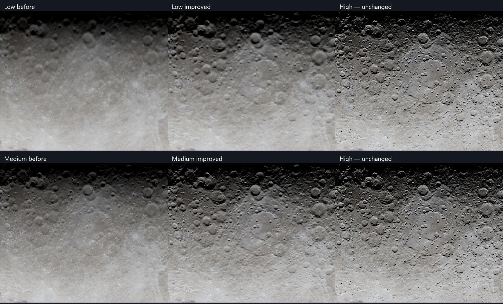

# Low/Medium Moon quality — 15 September 2026

Low and Medium now retain clearer crater edges and stronger relief at the same
GPU budgets. Medium improves visibly; Low remains softer in close-ups because
its terrain grid cannot contain High's fine detail. High is untouched.



## Code and assets

- `scripts/generate-moon-terrain.mjs` calculates native physical normals with
  the existing shared algorithm. `scripts/lib/moon-normal-reduction.mjs` then
  area-averages their tangent slopes before RGB8 packing. This avoids deriving
  slopes with a broad stencil after the height map has already been blurred.
- `moon-render-asset-profiles.js` selects V2 Low/Medium packages and normal
  compensation 2.1. Stronger settings made Low's coarse craters too rounded.
  Saved default V1 paths migrate to V2; custom paths and High are unchanged.
- Terrain heights are byte-identical to V1. Color maps, geometry, sample counts,
  shader, worker, preview and High's source/normal algorithms are unchanged.
  Asset preparation runs offline; it adds no runtime pass or normal generation.

| Budget | Low | Medium |
| --- | --- | --- |
| Terrain/normal dimensions, unchanged | 1024 × 512 | 2048 × 1024 |
| Geometry, unchanged | 256 × 128 | 384 × 192 |
| Shadow samples, unchanged | 4 | 8 |
| GPU texture memory/context, unchanged | ~12 MiB | ~48 MiB |
| New terrain package | 1,795,449 bytes | 7,319,808 bytes |
| Extra transfer | 98,011 bytes (+5.8%) | 272,763 bytes (+3.9%) |

At 10 Mbps, the extra payload represents about 0.08 s / 0.22 s of transfer
for Low / Medium. These are size-based estimates, not measured startup latency.
The preview/color assets and normal-installation work are unchanged; full startup
timing was not remeasured for V2.

## Visual validation

Baseline is `0c0483b`. Six matched 1494 × 996 views cover Manzinus, Earthset,
an oblique Artemis photo, gibbous phase and both quarters. The oblique/gibbous/
waxing views were held out from tuning. High is pixel-identical in all six, with
identical captured settings and unchanged hashes for its renderer, pipeline,
worker, normal algorithm and source assets.

Across these views, mean luminance difference from unchanged High falls by
8.5–14.7% for Low and 21.2–32.3% for Medium. This measures similarity to High,
not photographic ground truth. Only High pixels above 5/255 are scored; visual
review also inspects shadow boundaries and close-ups. No High/photo baselines
or thresholds were changed. [Full measurements](moon-low-medium-quality-2026-09-15.json).

Paired 1024² GPU draws on the RTX 4070 laptop measured median **0.142 → 0.142 ms**
for Low and **0.423 → 0.423 ms** for Medium. Each variant has 120 timed draws,
with alternating order and synchronized queues. Tail timings were variable;
these are local measurements, not mobile performance guarantees. Transfer is
slightly larger, while the first preview and runtime resource limits are unchanged.

Validation includes the full unit suite, all eight photographic comparisons,
Manzinus, eclipse darkness, preserved fill lighting, touch-layout loading and
prepared-normal installation. The unit suite passed 1,460 tests (31 skipped); Chromium passed all 23 observer/loading tests. WebKit passed five eclipse and touch-loading checks. These are desktop/browser-emulation checks, not physical-phone measurements.

## Reproduction and release

Matching data commit: [`f8aba77`](https://github.com/kvsankar/moon-mission-data/commit/f8aba774e07ce493dbe9b5aa36bf39c25cbb8a96).

```sh
node scripts/generate-moon-terrain.mjs
npm run test:unit
npm run test:browser:moon-observer
```

Mirror the two V2 packages and `terrain-v2-provenance.json` into the data repo,
then publish them before the consuming app. Keep V1 available for old consumers.
The [asset guide](../../operations/data/moon-render-assets.md) records preparation,
units and ownership. The local comparison page is `/.tmp/moon-tier-review/`.
