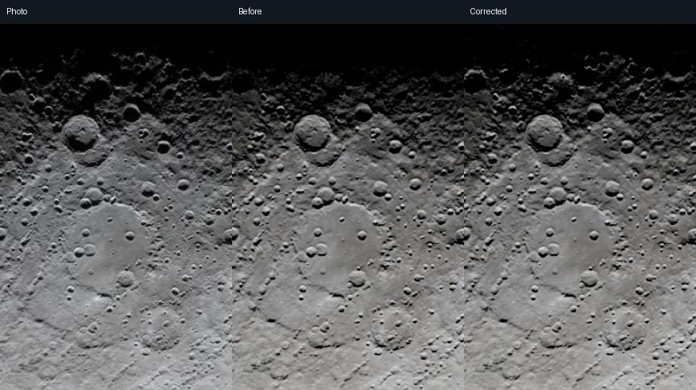

# Known-good working version: Moon terminator issue resolved

- **Checkpoint:** `moon-terminator-working-2026-09-11` (annotated Git tag)
- **Branch:** `codex/moon-render-architecture`
- **Acceptance date:** 2026-09-11
- **Status:** accepted working version; the user confirmed the corrected result.

This version solves the original hard terminator cutoff that incorrectly kept
raised terrain above Manzinus dark. It is the version to retain and compare
against before making further lighting changes. Fine DEM and photographic detail
still differ; those residual differences do not invalidate the resolved cutoff.

## What makes this the working version

The terrain-aware horizon test now actually executes in the fragment shader.
Three.js's vertex-only `USE_DISPLACEMENTMAP` flag is replaced there by a dedicated
Physical fragment flag and explicit height UVs. The physical shadow march also
handles signed solar altitude, so raised terrain can receive sunlight below the
radial horizon while intervening hills still cast shadows.

The checkpoint includes the full-Moon default, independent photo/render zoom and
pan, rotation, all eight camera registrations, matched photo brightness with a
manual override, and the regression tests developed during the comparison work.



Left: the supplied crop of NASA reference `art002e010208`. Center: the previous
render. Right: the corrected render. Both renders use the same camera, exposure,
DEM, and normal settings. This is documentation evidence, not a generated test
baseline that should be silently overwritten by a future run.

## Validation recorded for this checkpoint

- **46 focused tests passed**, including a numerical GPU visibility test,
  targeted ridge illumination and adjacent darkness checks above Manzinus,
  all-eight-photo photometry, the original Earthset/Ohm acceptance, and controls.
- **Production build passed**, with existing unrelated warnings.
- The GPU test failed before the fix: an elevated point beyond the base sphere's
  terminator incorrectly returned zero visibility. It now returns full visibility,
  while a deep night-side sample remains dark. Current retains its earlier behavior.
- In the native before/after crop, the fraction of reference-lit ridge pixels
  rendered below 16/255 fell from **90.1% to 32.0%**. The browser screenshot test
  measured **28.5%** after screenshot resampling. The test separately checks
  surrounding darkness so a blanket brightness increase cannot satisfy it.

These are deterministic numerical assertions with rendering tolerances. They
are not SSIM assertions, and they are not a claim of pixel-identical output across
all browser/GPU combinations or of perfect photographic reconstruction.

With runtime assets staged as described in the contributor guide, start the local
server on port 7275:

```sh
npx vite --host 127.0.0.1 --port 7275 --strictPort
```

In another terminal, run the focused validation:

```sh
npx vitest run test/moon-observer-artemis2-interaction.test.js test/moon-renderer.test.js test/moon-observer-artemis2.test.js test/moon-observer-image-view.test.js
npm run build
```

Open `moon-observer-test.html?observer=artemis2&reference=art002e010208&model=physical-dem&tier=high`.
The whole Moon is shown initially; Match photo framing applies the calibrated
comparison view.

## Retaining and revisiting the checkpoint

Keep the annotated tag immutable. To inspect the accepted version without
replacing a current working checkout:

```sh
git worktree add --detach ../moon-terminator-working moon-terminator-working-2026-09-11
```

Future lighting changes must retain the targeted ridge and darkness checks, not
just pass a whole-image average. Keep this evidence and tag when adding newer
working versions.

## Runtime inputs used for validation

The Git tag identifies the application code. Staged runtime assets must also
match for exact reproduction. Recorded SHA-256 values:

| Asset | SHA-256 |
|---|---|
| `images/moon/lroc_color_2025_16k_quality.jpg` | `14ba95e251dd444ad408df91a7004ee1801c333f0fa8f963be0db692a00e4ebe` |
| `images/moon/ldem_16_uint_quality.png` | `37b3a7f19157298e21a3a0cb982827f20bf71fbbfe4f79565da95b9dbdc19a81` |
| `assets/artemis2/data/media-manifest.json` | `07f5a47d0d70058f5fad264937bc4f48f3e19a9244f776acfd7ae123bfb72274` |
| `assets/artemis2/data/lunar-ORION-cheb.json` | `aea73febf39e5409813ed4f2b637df485cdc83a966bfb3fc1b65fb0d930a25f1` |

The reference IDs and URLs are recorded in the manifest. The photo/DEM assets
remain in their established data/media locations; this checkpoint does not
relocate them into the application repository.

Details: [shader root cause and GPU/ridge checks](manzinus-horizon-fix.md) and
[Artemis camera/display calibration](artemis-reference-calibration.md).
